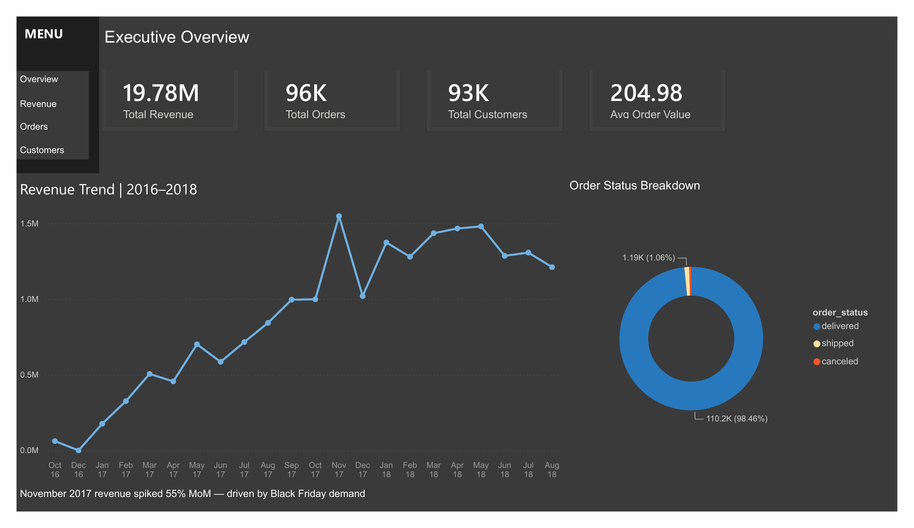
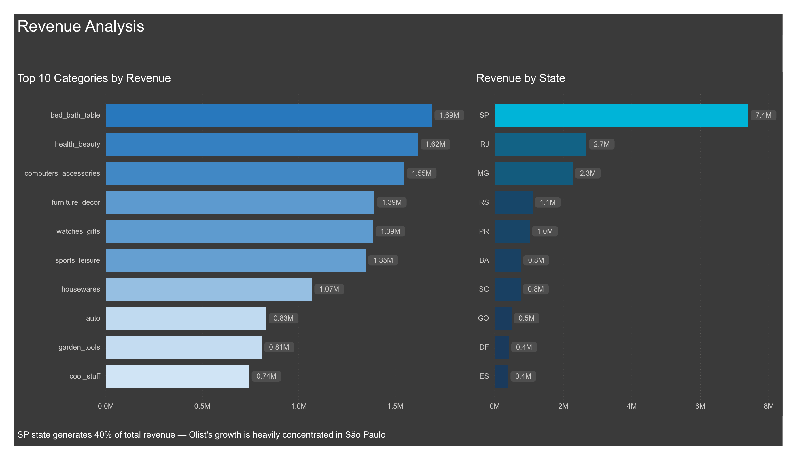
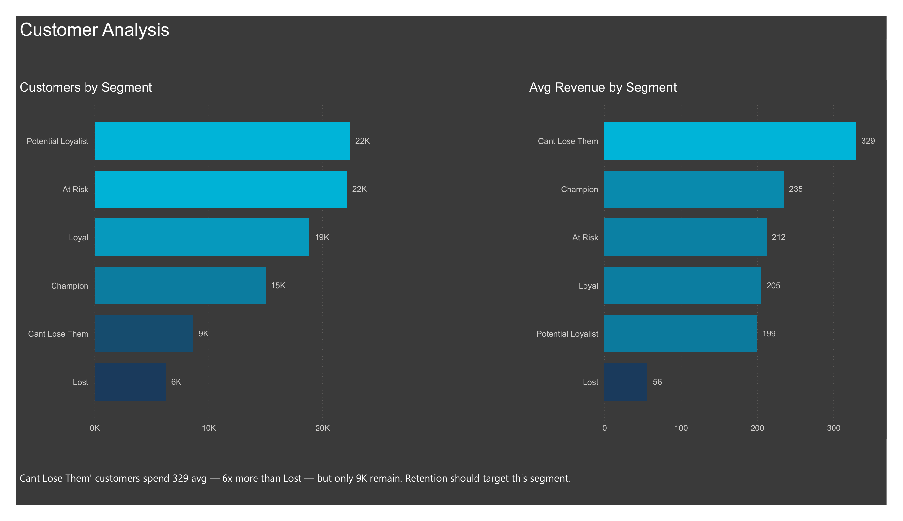
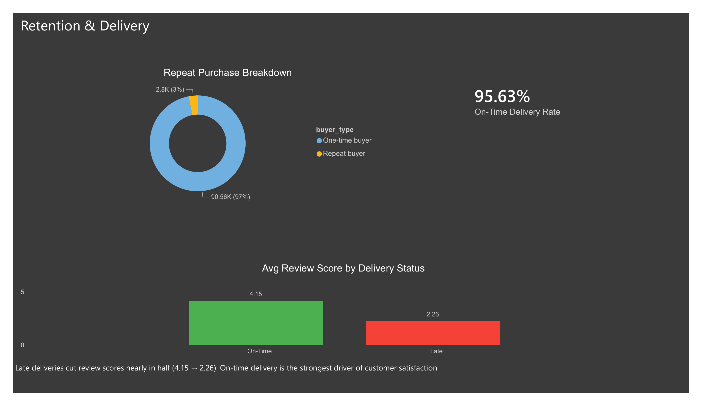
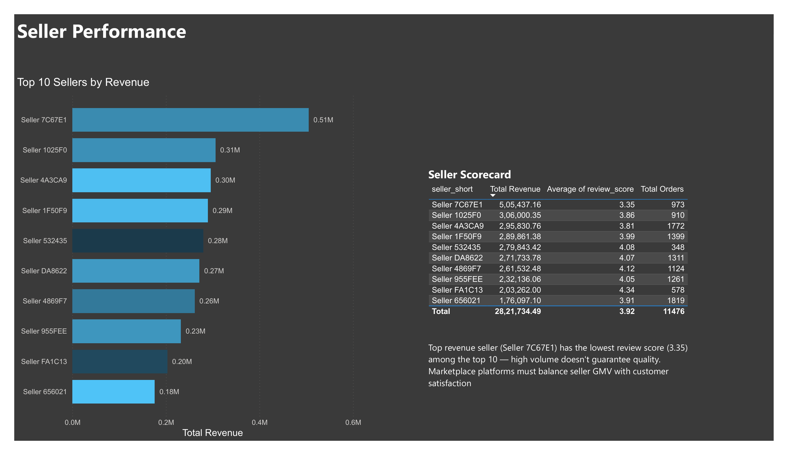

# Olist Brazilian E-Commerce Analytics

Analyzed 100K+ real orders from Olist, a Brazilian e-commerce marketplace, spanning 2016 to 2018. The project covers the full analytics workflow: modeling raw data into a star schema, writing SQL queries for business insights, building RFM customer segmentation in Python, and putting it all together in a 5-page Power BI dashboard.

## What I Used

**SQL (MySQL):** Star schema design, 8 analytical queries, window functions (LAG, NTILE, ROW_NUMBER), CTEs, JOINs across 5 tables

**Python (Pandas, Matplotlib):** RFM segmentation with `pd.qcut()`, data cleaning, groupby aggregations, chart exports

**Power BI:** 5 interactive dashboard pages with DAX measures (CALCULATE, DIVIDE, DISTINCTCOUNT), calculated columns, gradient visuals, Top N filters

## About the Dataset

Source: [Olist Brazilian E-Commerce Public Dataset on Kaggle](https://www.kaggle.com/datasets/olistbr/brazilian-ecommerce)

8 relational tables covering orders, customers, sellers, products, reviews, payments, and geolocation. Real anonymized commercial data, not synthetic.

## Project Structure

```
├── 01_star_schema_load.py        # Schema creation and data loading script
├── 02_sql_analytics.sql          # 8 business queries
├── 03_rfm_segmentation.ipynb     # Python RFM notebook
├── Olist_Dashboard.pbix          # Power BI file
├── Olist_Dashboard.pdf           # PDF export of all 5 pages
├── screenshots/
│   ├── 01_executive_summary.png
│   ├── 02_revenue_analysis.png
│   ├── 03_customer_analysis.png
│   ├── 04_retention_delivery.png
│   └── 05_seller_performance.png
└── README.md
```

## How I Modeled the Data

Took 8 raw Kaggle CSVs and restructured them into a star schema with one fact table and four dimension tables:

| Table | Role | Key |
|-------|------|-----|
| `fact_orders` | Fact | order_id, order_item_id |
| `dim_customers` | Dimension | customer_unique_id |
| `dim_sellers` | Dimension | seller_id |
| `dim_products` | Dimension | product_id |
| `dim_date` | Dimension | date_id |

This made the Power BI relationships straightforward and kept queries clean.

## What I Found

**97% of customers never came back.** Out of 93K unique customers, only about 3% placed more than one order. This points to a fundamental gap in post-purchase engagement rather than a product or pricing issue.

**Late deliveries nearly halved review scores.** Orders delivered on time averaged a 4.15 review score. Late orders dropped to 2.26. Delivery reliability turned out to be the biggest lever for customer satisfaction in this dataset.

**November 2017 saw a 55% month-over-month revenue spike.** Black Friday drove the sharpest growth in the entire dataset, confirming strong seasonal patterns.

**São Paulo alone accounts for 40% of revenue.** Geographic concentration is extreme. The next biggest state (RJ) contributes only 14%.

**High-value customers are slipping away.** The "Can't Lose Them" RFM segment spends 6x more than Lost customers on average, but only 9K of them remain. They're the highest-priority retention target.

**The top revenue seller has the worst reviews.** Seller 7C67E1 generated the most revenue among the top 10 but scored only 3.35 out of 5 in reviews. Volume and quality don't always go together.

## Dashboard Pages

### Page 1: Executive Summary

KPI cards (Total Revenue 19.78M, 96K Orders, 93K Customers, AOV 204.98), monthly revenue trend, order status donut.

### Page 2: Revenue Analysis

Top 10 product categories by revenue, revenue breakdown by state with gradient bars.

### Page 3: Customer Analysis

RFM segment distribution and average revenue per segment. Shows where the high-value customers sit.

### Page 4: Retention & Delivery Performance

97% one-time buyer donut, 95.63% on-time delivery rate, and the green vs red review score comparison that tells the delivery story instantly.

### Page 5: Seller Performance

Top 10 sellers by revenue alongside a scorecard table showing the revenue vs review quality tradeoff.

## SQL Queries

1. Monthly revenue trend with LAG() for MoM growth
2. Top revenue categories
3. Repeat purchase rate
4. Delivery SLA analysis (on-time vs late, with review score impact)
5. Top seller scorecard
6. Revenue by state
7. Cohort retention analysis
8. RFM scoring with NTILE()

## RFM Segmentation

Scored each customer on Recency (days since last order), Frequency (order count), and Monetary value (total spend) using `pd.qcut()` in Pandas. Mapped the combined scores to six segments: Champion, Loyal, Potential Loyalist, At Risk, Can't Lose Them, and Lost.

## What I'd Recommend to Olist

1. **Retention is the real problem.** 97% one-time buyers means the post-purchase experience needs work. Email sequences, loyalty programs, and reorder reminders would be the first things to test.

2. **Protect delivery SLA at all costs.** The 4.15 vs 2.26 review gap is massive. Tighter logistics partnerships and delivery guarantees should be a priority.

3. **Win back "Can't Lose Them" customers.** They spend 6x more than average but are at risk of churning. Personalized outreach here has the highest ROI.

4. **Don't just reward seller volume.** The top seller by revenue has the worst reviews. Introduce quality thresholds so high-GMV sellers don't erode platform trust.

5. **Reduce São Paulo dependency.** 40% concentration in one state is risky. Growth campaigns in RJ, MG, and other states would diversify the revenue base.

---

**Author:** Vaibhav Viraj
**LinkedIn:** [linkedin.com/in/vaibhavviraj](https://linkedin.com/in/vaibhavviraj)
**GitHub:** [github.com/vaibhavneu](https://github.com/vaibhavneu)
